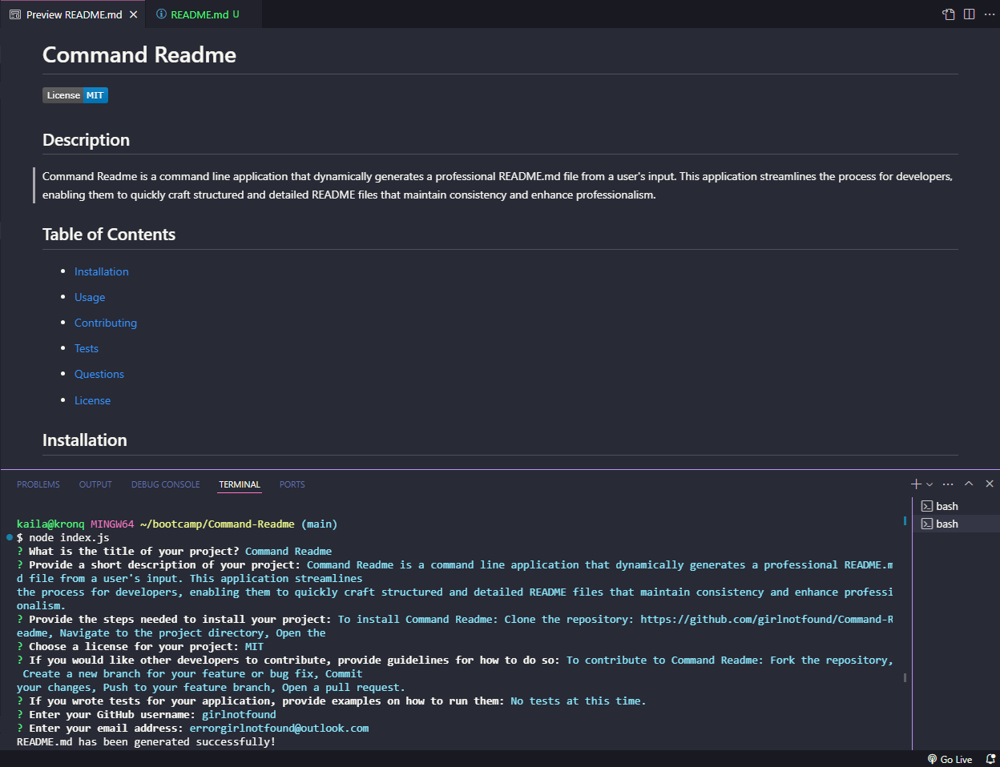

# Command Readme

## Description

Command Readme is a command line application that dynamically generates a professional README.md file from a user's input. This application streamlines the process for developers, enabling them to quickly craft structured and detailed README files that maintain consistency and enhance professionalism.

## Table of Contents

- [Installation](#installation)
- [Usage](#usage)
- [Contributing](#contributing)
- [Tests](#tests)
- [Questions](#questions)

- [License](#license)

## Installation

To install Command Readme: Clone the repository: https://github.com/girlnotfound/Command-Readme, Navigate to the project directory, Open the terminal and run the command npm install.

## Usage

To use Command Readme in the terminal run the command: node index.js, you will be prompted to answer questions about your project.

[Link to Walk Through Video](https://app.screencastify.com/v3/watch/RsIEm1HuNyn6IHFO2x0p)

## Credits

Adam Rosenberg https://github.com/AcoderRose, Ryan Petersen https://github.com/RyanPetersen-89, Jordan Gonzales https://github.com/JordanGWiz

## License

This project is licensed under the MIT license.

## Contributions

To contribute to Command Readme: Fork the repository, Create a new branch for your feature or bug fix, Commit your changes, Push to your feature branch, Open a pull request.

## Tests

No tests at this time.

## Questions

For any questions, please contact me via:

- GitHub: [girlnotfound](https://github.com/girlnotfound)
- Email: errorgirlnotfound@outlook.com
